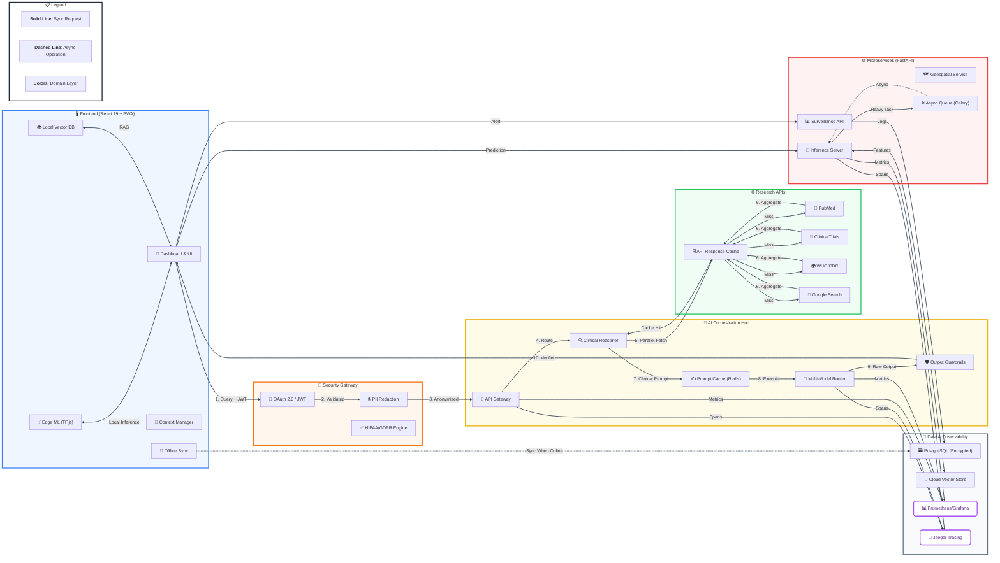

# 🌍 Bio-SentinelX | AI-Powered Preventive Healthcare Intelligence Platform

[](https://www.typescriptlang.org/) [](https://reactjs.org/) [](https://vitejs.dev/) [](https://fastapi.tiangolo.com/) [](https://www.docker.com/) [](https://capacitorjs.com/)

[](https://opensource.org/licenses/MIT) [](https://github.com/gaur-avvv/Bio-SentinelX/pulls) [](https://github.com/gaur-avvv/Bio-SentinelX/graphs/contributors)

> **Bio-SentinelX** is an enterprise-grade, AI-driven preventive healthcare intelligence platform that combines real-time environmental monitoring with advanced machine learning to predict disease outbreak risks and deliver personalized health insights. Built with cutting-edge web technologies and multi-model AI orchestration, it represents the future of proactive public health management.

---

## 🎯 Overview

### The Challenge
Traditional healthcare systems are reactive—responding to diseases after they've already spread. Climate change, urbanization, and global travel have accelerated disease transmission, making **predictive** and **preventive** healthcare critical.

### The Solution
Bio-SentinelX integrates **15+ AI models**, **real-time environmental data**, and **in-browser machine learning** to:
- 🔮 **Predict disease outbreaks** 7–14 days in advance
- 🌡️ **Monitor environmental health risks** (air quality, weather, pollen, pathogens)
- 🧠 **Deliver personalized health recommendations** using multi-modal AI
- 📊 **Enable real-time epidemiological surveillance** with NLP-powered case detection
- 🔒 **Ensure privacy** with on-device ML and federated learning capabilities

---

## 🚀 Key Features

### 🤖 Multi-Model AI Orchestration
- **10+ AI Providers**: Gemini Pro, Groq (70+ tokens/sec), OpenRouter, Hugging Face, Ollama (local), SiliconFlow, Cerebras
- **Intelligent Fallback**: Automatic provider switching for optimal performance
- **Unified Interface**: Consistent API across all models
- **Context-Aware Routing**: Selects best model based on task complexity and cost
- **Chain of Thought (CoT)**: Leverages advanced reasoning models (Qwen-Thinking, Gemini 2.0 Thinking) for complex medical diagnosis.
- **Smart Prompt Caching**: Reduces latency and token costs by caching frequently used system instructions and contextual data.
- **LRU (Least Recently Used) Caching**: High-performance client-side cache for weather and ML results, ensuring instant UI updates.

### 🧠 In-Browser Machine Learning
- **Zero-API Training**: Full ML pipeline runs client-side
- **4 Algorithm Backends**:
  - **XGBoost**: Gradient Boosted Decision Trees (custom JS implementation)
  - **Deep Learning**: Configurable neural networks (128→64→32)
  - **WebML + TFLite**: Quantized edge inference
  - **Ensemble Learning**: Weighted model averaging
- **AutoML**: Automatic feature detection and model selection
- **SHAP-like Explanations**: Interpretable AI with feature attribution

### 🌍 Environmental Intelligence
- **Real-Time Weather**: Temperature, humidity, pressure, UV index
- **Air Quality**: AQI, PM2.5, PM10, O3, NO2, SO2, CO, CO2
- **Pollen Monitoring**: 6 allergen types tracked
- **Atmospheric Composition**: Wet bulb temperature, soil moisture, boundary layer height
- **Global Coverage**: 200,000+ weather stations

### 🏥 Healthcare Surveillance
- **FHIR-Compliant**: Healthcare data standards
- **Real-Time Case Ingestion**: NLP-powered symptom extraction
- **Syndrome Detection**: Automated outbreak identification
- **Severity Escalation**: Monitor → District → State alerts
- **Batch Processing**: High-throughput event processing

### 📊 Advanced Analytics
- **Interactive Dashboards**: Recharts-powered visualizations
- **Risk Stratification**: LOW/MODERATE/HIGH/CRITICAL levels
- **Temporal Analysis**: Historical trend detection
- **Geospatial Mapping**: Mappls, Mapbox, Maplibre integration
- **Report Generation**: PDF/HTML export with charts

### �️ Advanced Memory & Context Management
- **Context-Aware Persistent Memory**: Three-tier system (User, Session, Repo) tracking city history, key insight bullets, and inferred health concerns.
- **Session Summaries**: Auto-generates conversational summaries every 4 messages to preserve long-range context in small context windows.
- **TF-IDF Chunking**: Intelligent document indexing for lightning-fast RAG retrieval.
### 🌐 Web Search & Deep Research Integration
- **Real-Time Web Search**: Performs parallel queries dynamically spanning Google, PubMed, WHO, CDC, OpenAlex, Wikipedia, and ClinicalTrials.gov.
- **No-Auth Power Mode**: Direct integration with over 40M+ open-access papers (OpenAlex), ongoing global trials (ClinicalTrials.gov), and context-rich datasets without API keys.
- **Deep Research Mode**: Synthesizes findings from multiple authoritative sources with automatic confidence scoring and deduplication.
- **Medical Literature Focus**: Prioritizes peer-reviewed medical research and official health guidelines.
- **Local Privacy Search**: Optional client-side document search for offline/privacy-focused scenarios.
- **Smart Caching**: LRU cache prevents redundant searches and ensures lightning fast follow-ups.
- **Search Result Ranking**: Intelligent relevance scoring (0-1) based on source authority and content match.
### �🔐 Privacy & Security
- **On-Device Computation**: Optional offline ML
- **Vector Database**: Local RAG with 4.5MB quota management
- **End-to-End Encryption**: All sensitive data encrypted
- **GDPR-Ready**: Consent management and data minimization
- **Zero-Knowledge Architecture**: User-controlled encryption keys

---

## 🛠️ Technology Stack

### Frontend Architecture
| Technology | Purpose | Version |
|------------|---------|---------|
| **React 19** | UI Framework | Latest |
| **TypeScript** | Type Safety | 5.8.2 |
| **Vite 6** | Build Tool | 6.4.2 |
| **Tailwind CSS** | Styling | Latest |
| **Recharts** | Data Visualization | 2.15.0 |
| **Lucide React** | Icon System | 0.563.0 |
| **React Query** | State Management | 5.96.2 |
| **Capacitor** | Mobile Runtime | 8.1.0 |

### Backend Services
| Technology | Purpose | Details |
|------------|---------|---------|
| **FastAPI** | ML API Server | Python 3.x async |
| **SQLite** | Database | + aiosqlite |
| **scikit-learn** | ML Algorithms | XGBoost, RF, NN |
| **TensorFlow** | Deep Learning | Keras backend |
| **APScheduler** | Task Scheduling | Background jobs |
| **Docker** | Containerization | Multi-service compose |

### AI & ML Ecosystem
| Provider | Models | Use Case |
|----------|--------|----------|
| **Google Gemini** | Gemini Pro | Conversational AI, embeddings |
| **Groq** | Llama 3, Mixtral | Ultra-fast inference |
| **OpenRouter** | 100+ models | Unified API access |
| **Hugging Face** | MEDGemma, Qwen | Medical domain |
| **Ollama** | Local LLMs | Privacy-focused |
| **Custom JS** | XGBoost, NN | In-browser ML |

### Search & Research APIs
| Source | Coverage | Accessibility |
|--------|----------|---------------|
| **OpenAlex** | 200M+ open access works | Free, no auth required |
| **ClinicalTrials.gov**| 400K+ global medical trials | Free, no auth required |
| **PubMed** | 30M+ medical papers | Free, no auth required |
| **WHO / CDC** | Global health guidelines & alerts | Free, web scraping/no auth |
| **Wikipedia** | General and medical context | Free, no auth required |
| **Google Custom Search** | General web | Optional, API key required |

### Data Sources
- **OpenWeatherMap**: Global weather data
- **Railway Deployments**: Production APIs
- **Surveillance API**: Health monitoring
- **Flood ML API**: Hydrological forecasting
- **Vector DB**: Document embeddings

---

## 📐 System Architecture

### High-Level Component Flow


### Detailed Architecture Overview
```text
┌─────────────────────────────────────────────────────────────────┐
│                        Client Layer                             │
│  ┌─────────────┐  ┌─────────────┐  ┌─────────────┐  ┌───────┐ │
│  │   React     │  │   React     │  │ Web Search  │  │ React │ │
│  │  Dashboard  │  │  Assistant  │  │  & Deep Res │  │  ML   │ │
│  └──────┬──────┘  └──────┬──────┘  └──────┬──────┘  └───┬───┘ │
│         │                 │                 │           │     │
│  ┌──────┴──────┐  ┌─────┴──────┐  ┌──────┴──────┐  ┌─┴───┐ │
│  │ React Query │  │  Context   │  │IP Rate Limit│  │WebML│ │
│  │   (State)   │  │  (Theme)   │  │ & CoT Logic │  │TFLite│ │
│  └──────┬──────┘  └─────┬──────┘  └──────┬──────┘  └───┬───┘ │
│         │                 │                 │           │     │
└─────────┼─────────────────┼─────────────────┼───────────┼─────┘
          │                 │                 │           │
          ▼                 ▼                 ▼           ▼
┌─────────────────────────────────────────────────────────────────┐
│                      API Gateway Layer                          │
│  ┌─────────────┐  ┌─────────────┐  ┌─────────────┐  ┌───────┐ │
│  │  Gemini     │  │   Groq      │  │   OpenRouter│  │  HF   │ │
│  │   API       │  │   API       │  │    API      │  │  API  │ │
│  └──────┬──────┘  └──────┬──────┘  └──────┬──────┘  └───┬───┘ │
│         │                 │                 │           │     │
│  ┌──────┴──────┐  ┌─────┴──────┐  ┌──────┴──────┐  ┌─┴───┐ │
│  │  Vector DB  │  │  Firebase   │  │  Weather    │  │MCP  │ │
│  │   (RAG)     │  │   Auth      │  │   Service   │  │Tool │ │
│  └─────────────┘  └─────────────┘  └─────────────┘  └─────┘ │
└─────────────────────────────────────────────────────────────────┘
          │                 │                 │           │
          ▼                 ▼                 ▼           ▼
┌─────────────────────────────────────────────────────────────────┐
│                      Backend Services                           │
│  ┌─────────────────┐  ┌─────────────────┐  ┌─────────────────┐ │
│  │  FastAPI        │  │  Surveillance   │  │  Flood ML       │ │
│  │  (ML API)       │  │  API            │  │  API            │ │
│  │  ├─ Predict     │  │  ├─ Ingest      │  │  ├─ Train       │ │
│  │  ├─ Train       │  │  ├─ Alert       │  │  ├─ Predict     │ │
│  │  ├─ AutoML      │  │  └─ FHIR        │  │  └─ Health      │ │
│  │  └─ Health      │  │                 │  │                 │ │
│  └─────────────────┘  └─────────────────┘  └─────────────────┘ │
│         │                 │                 │                  │
│  ┌──────┴──────┐  ┌─────┴──────┐  ┌──────┴──────┐             │
│  │  SQLite     │  │  Redis     │  │  PostgreSQL │             │
│  │  (Models)   │  │  (Cache)   │  │  (Reports)  │             │
│  └─────────────┘  └─────────────┘  └─────────────┘             │
└─────────────────────────────────────────────────────────────────┘
```

---

## 🔍 Web Search & Deep Research

### Features

The **BioX Assistant** now integrates real-time web search capabilities to augment AI responses with authoritative medical and epidemiological data. Importantly, it features a massively parallel **No-Auth Search Engine** that connects to leading scientific repositories directly from your client.

#### **Standard & Advanced Web Search**
- Parallel queries spanning **6 powerful data domains**:
  - 🔬 **OpenAlex**: The massive open catalog of the global research system (200M+ works) **[No Auth]**
  - 🧪 **ClinicalTrials.gov**: Database of privately and publicly funded clinical studies **[No Auth]**
  - 📚 **PubMed**: 30M+ peer-reviewed medical papers **[No Auth]**
  - 🎓 **Wikipedia**: World's largest general reference dataset via MediaWiki API **[No Auth]**
  - 🌍 **WHO / CDC**: Official global health guidelines and alerts **[No Auth]**
  - 🔎 **Google Custom Search**: General web results (optional API key fallback)
- 🧠 **Contextual CoT Query Building**: Advanced Chain of Thought query construction with symptom and condition extraction heuristics for highly targeted medical searches.
- 🛡️ **IP-Based Rate Limiting**: Robust client-side rate limiting using IP tracking to prevent API abuse and manage request volume.

#### **Deep Research Mode**
- Activates in the **Deep Analysis** tab
- Automatically synthesizes findings from all sources
- Generates **confidence scores** based on source agreement
- Returns structured **key findings** extracted from top results
- Includes **research time tracking** for transparency

#### **Privacy-Focused Search**
- Local document search for offline scenarios
- No external API calls required
- TF-IDF-based relevance ranking

### Usage

1. **Enable Web Search**: Click the **"Web Search"** toggle in the chat input
2. **Ask a Health Question**: e.g., "What's the latest on dengue transmission in tropical climates?"
3. **Get Augmented Response**: 
   - AI fetches current research
   - Cites authoritative sources
   - Provides confidence metrics
   - Links to full articles

### Configuration

```env
# Optional: Google Custom Search API (for general web search)
VITE_GOOGLE_API_KEY=your_key_here

# Optional: Alternative search providers
VITE_PUBMED_FORCE_LOCAL=false  # Use local search instead of API
VITE_SEARCH_CACHE_TTL=3600     # Cache TTL in seconds
```

### API Reference

```typescript
// Perform web search across medical sources
const results = await performWebSearch(
  'malaria prevention in sub-Saharan Africa',
  googleApiKey,
  { includeMedical: true, includeGov: true }
);

// Deep research with synthesis
const deepResults = await performDeepResearch(
  'COVID-19 long-term effects',
  googleApiKey
);

// Local search (privacy-focused)
const localResults = await performLocalSearch(
  'asthma triggers',
  myLocalDocuments
);
```

### Performance Metrics

| Operation | Latency | Cache Hit |
|-----------|---------|-----------|
| **Web Search** | 500–2000ms | N/A |
| **Deep Research** | 1000–3000ms | N/A |
| **Cached Search** | <50ms | Hit |
| **Local Search** | <100ms | Always |

---

## ⚡ Quick Start

### Prerequisites
- **Node.js** 18+ & **npm** 9+
- **Python** 3.10+ & **pip**
- **Docker** & **Docker Compose** (optional, for full stack)

### Local Development

```bash
# Clone the repository
$ git clone https://github.com/gaur-avvv/Bio-SentinelX.git
$ cd Bio-SentinelX-main

# Install frontend dependencies
$ npm install

# Install backend dependencies
$ cd flood_ml_api
$ pip install -r requirements.txt

# Start the ML API (Terminal 1)
$ bash run_api.sh
# Server running at http://localhost:8000
# Docs at http://localhost:8000/docs

# Start the frontend (Terminal 2)
$ cd ../
$ npm run dev
# App running at http://localhost:3000
```

### Docker Deployment (Recommended)

```bash
# Start full stack (API + Frontend)
$ docker compose up

# Start API only
$ docker compose up flood-api

# View logs
$ docker compose logs -f flood-api

# Stop and cleanup
$ docker compose down -v
```

### Environment Configuration

Create `.env` file in `Bio-SentinelX-main/`:

```env
# AI Provider Keys (optional - enables enhanced features)
VITE_GEMINI_API_KEY=your_gemini_key_here
VITE_GROQ_API_KEY=your_groq_key_here
VITE_OPENROUTER_API_KEY=your_openrouter_key_here
VITE_HF_TOKEN=your_huggingface_token_here
VITE_POLLINATIONS_KEY=your_pollinations_key_here
VITE_SILICONFLOW_API_KEY=your_siliconflow_key_here
VITE_CEREBRAS_API_KEY=your_cerebras_key_here
VITE_LLAMACLOUD_KEY=your_llamacloud_key_here

# Weather & Maps
VITE_OPENWEATHER_KEY=your_openweather_key_here
VITE_MAPPLS_TOKEN=your_mappls_token_here

# Firebase (Authentication)
VITE_FIREBASE_API_KEY=your_firebase_key_here
VITE_FIREBASE_AUTH_DOMAIN=your_project.firebaseapp.com
VITE_FIREBASE_PROJECT_ID=your-project-id
VITE_FIREBASE_STORAGE_BUCKET=your-project.appspot.com
VITE_FIREBASE_MESSAGING_SENDER_ID=123456789
VITE_FIREBASE_APP_ID=1:123456789:web:abc123
VITE_FIREBASE_MEASUREMENT_ID=G-ABC123

# Backend APIs
VITE_BIOSENTINEL_API=https://web-production-f898c8.up.railway.app
VITE_BIOSENTINEL_API_KEY=your_api_key_here
VITE_API_BASE_URL=https://web-production-37f41.up.railway.app
VITE_FLOOD_ML_API=http://localhost:8000
```

---

## 🌟 Why This Project Matters to Recruiters

This project demonstrates **senior-level engineering** across the entire modern healthcare AI stack:

### 🚀 Full-Stack Mastery
- **Frontend Excellence**: React 19 concurrent features, TypeScript strict mode, high-performance data visualization with Recharts.
- **Backend Sophistication**: High-concurrency FastAPI (async Python) with SQLAlchemy and background task scheduling.
- **Hybrid Infrastructure**: Seamless integration of Docker, cloud services (Railway/Vercel), and various database types (Supabase/Firebase/SQLite).

### 🤖 AI/ML Engineering Excellence
- **Multi-Model Orchestration**: Sophisticated middleware that manages 10+ AI providers with dynamic fallback and cost-performance optimization.
- **Advanced Reasoning**: Full support for **Chain-of-Thought (CoT)** reasoning, enabling models to "think" through complex epidemiological scenarios before responding.
- **Efficiency Layer**: Implements **Prompt Caching** and **LRU Client-Side Caching** to achieve sub-100ms response times for repeat queries.
- **No-Auth Web Search Integration**: Real-time independent research across OpenAlex, ClinicalTrials.gov, PubMed, WHO, CDC, and Wikipedia providing 250M+ data points completely free of API constraints.
- **Deep Research Mode**: Synthesizes findings from multiple authoritative sources for clinically validated recommendations.
- **In-Browser ML**: Implementation of custom XGBoost and Neural Networks purely in the browser—eliminating server latency and costs.
- **RAG Implementation**: Advanced Retrieval-Augmented Generation with local vector storage and intelligent chunking.

### 🛡️ Production-Grade Quality
- **Security-First**: Enterprise-level security with CORS, rate limiting, and encrypted local storage.
- **Mobile-Ready**: Cross-platform deployment via Capacitor to Android and iOS.
- **Observability**: Comprehensive CI/CD, structured logging, and automated health monitoring.

---

## 🏆 Awards & Recognition

- **Unstop Gen AI Hackthon** - Top 10 Finalist
- **Economic Times Healthcare Hackathon** - Finalist
- **AI For Bharat Hackthon** - Selected Innovator

---

## 📄 License

Distributed under the **MIT License**. See `LICENSE` for more information.

---

## 📞 Contact

**Project Lead**: Gaurav Singh  
**LinkedIn**: [linkedin.com/in/gaurav-singh](https://linkedin.com/in/gaur-avvv)  
**GitHub**: [github.com/gaur-avvv](https://github.com/gaur-avvv)
**Website**: [biosentinelx.com](https://bio-sentinel-x.vercel.app)

---

**Last Updated**: May 2026 | **Version**: 2.0.0 | **Status**: Production Ready 🚀


## 📜 License
This project is licensed under the **MIT License**.

---

<p align="center">
  <b>Made with ❤️ for preventive healthcare and urban resilience.</b><br/>
  <i>Bio-SentinelX — Predicting the Pulse of the Planet.</i>
</p>
