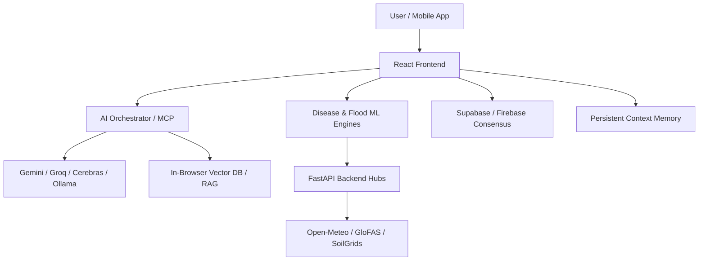

# 🛡️ Bio-SentinelX
## AI-Powered Planetary Health & Urban Resilience Platform

<p align="center">
  
</p>

[](https://opensource.org/licenses/MIT)
[](https://www.typescriptlang.org/)
[](https://reactjs.org/)
[](https://vitejs.dev/)
[](https://github.com/gaur-avvv/Bio-SentinelX/graphs/commit-activity)

> **Bio-SentinelX** is a next-generation intelligence platform designed to predict, monitor, and mitigate planetary health risks before they escalate. By fusing real-time environmental data, multi-hub machine learning, and advanced LLM orchestration, we empower communities with proactive urban resilience.

---

## 🎯 Core Vision: Preventive, Not Reactive
Current healthcare systems are built for reaction—treating symptoms after they appear. Bio-SentinelX shifts this paradigm by predicting risks based on environmental, clinical, and hydrodynamic signals.

---

## 🧩 The Bio-SentinelX Trifecta (Consensus Hubs)

### 1. 🦠 Disease Risk Hub (Predictive ML)
A sophisticated backend that forecasts outbreak probabilities by analyzing 20+ atmospheric variables alongside historical health data.
- **Stacked Ensemble Model**: Features a robust architecture combining **Random Forest**, **XGBoost**, and **LightGBM** with a **Logistic Regression meta-learner**.
- **In-Browser Training**: Upload custom CSV datasets (up to 50MB/100k rows) for real-time model retraining with automatic feature detection.
- **Accuracy**: achieving ~91% precision on Hydro-Environmental health triage.

### 2. 🏥 Symptom Surveillance (Symptom-X)
The platform’s real-time clinical ingestion engine for monitoring syndrome trends.
- **Dynamic Surveillance**: Maps community symptom reports against environmental stressors in real-time.
- **Enterprise Connectivity**: Seamlessly syncs clinical data across **Supabase (PostgreSQL)** and **Firebase** for high-availability database consensus.

### 3. 🌊 Flood Prediction Engine (GIS-ML)
A GIS-integrated ML engine for identifying urban flood micro-hotspots and generating Pre-Monsoon Readiness Scores.
- **Explainable AI (XAI)**: High-fidelity **SHAP (SHapley Additive exPlanations)** attribution plots visualize the primary drivers behind risk scores (e.g., Rainfall vs. River Discharge).
- **GLoFAS Integration**: Real-time river discharge monitoring using GloFAS v4 with 60-day ensemble forecasts.
- **Micro-Hotspot Identification**: Scans and identifies 2,500+ micro-hotspots with ward-level granularity.

---

## 🚀 Advanced Features & Technical Deep Dive

### 🧠 BioX AI Assistant & MCP Orchestration
- **Context-Aware Conversational Intelligence**: The assistant understands current weather, ML predictions, and the user’s Health Profile.
- **MCP Tool Orchestration**: Supports the **Model Context Protocol** to interact with external tools, knowledge graphs, and clinical protocols.
- **Multi-Provider Waterfall**:
  - **Cerebras**: 3000+ tokens/sec inference with automatic prompt caching.
  - **Groq**: Llama 3.3 70B & Mixtral 8x7B at ultra-fast speeds.
  - **SiliconFlow**: Access to DeepSeek V3, Qwen, Kimi, and MiniMax.
  - **Gemini**: 2.5 Flash/Pro, 2.0, 1.5 Pro/Flash integration.
  - **Pollinations**: Zero-API-key fallback for uninterrupted intelligence.

### 🗂️ Three-Tier Persistent Memory
1. **Report Chunking**: Health reports are sectioned and indexed using TF-IDF for lightning-fast retrieval.
2. **Cross-Session Memory**: Tracks city history, key insight bullets, and inferred health concerns across reloads.
3. **Session Summaries**: Auto-generates conversational summaries every 4 messages to preserve context.

### 🗺️ GIS & Interactive Mapping
- **GIS Agnostic**: Native support for **ArcGIS**, **Mappls**, **Mapbox**, and **MapTiler**.
- **Real-Time Overlays**: Visualizes ward-level readiness scores, flood micro-hotspots, and regional outbreak risks.

### 📚 Research Library (In-Browser RAG)
- **Vector Database**: Fully client-side vector search using **Cosine Similarity**.
- **Dual Embedding Strategy**: Uses **Gemini dense embeddings** (text-embedding-004) with a **TF-IDF fallback** for offline or privacy-focused usage.

### 📧 Early-Warning Alert Engine
- **Rule-Based Triggers**: 20+ automated rules covering Heat Stress (>35°C), UV Damage (Index > 6), AQI Hazards (>100), and Storm Potential (CAPE > 1000 J/kg).
- **Automated Emailing**: Integration with **Resend**, **SendGrid**, and **EmailJS** for automated distribution of health advisories.

---

## 📊 Health Coverage Matrix

| Domain | Conditions Monitored |
|--------|---------------------|
| **Respiratory** | Asthma, COPD, Pollen Allergies, Mold Exposure, Bronchitis |
| **Cardiovascular** | Heat-induced Cardiac Stress, Hypertension, Pressure Migraines |
| **Infectious Disease** | Waterborne Outbreaks, Airborne Pathogens, Seasonal Flu |
| **Heat Stress** | Heat Stroke, Heat Exhaustion, Wet-Bulb Danger, UV Damage |
| **Mental Health** | SAD Risk, Sunshine-Deficit Depression, Sleep Disruption |
| **Vector-Borne** | Mosquito Proliferation (Dengue/Malaria), Tick Activity |

---

## 🛠️ Technical Architecture



---

## 📦 Quick Start

### Option A — Docker Compose (recommended, full stack)
```bash
git clone https://github.com/gaur-avvv/Bio-SentinelX.git
cd Bio-SentinelX
cp .env.example .env          # edit with your API keys
cp flood_ml_api/.env.example flood_ml_api/.env
docker compose up             # frontend → :3000 | ML API → :8000
```

### Option B — Manual (frontend only)
```bash
npm install
cp .env.example .env          # fill in keys
npm run dev                   # http://localhost:3000
```

### Option C — Manual (ML API only)
```bash
cd flood_ml_api
pip install -r requirements.txt
cp .env.example .env          # fill in DATABASE_URL, CORS_ORIGINS
uvicorn main:app --reload --port 8000
```

---

## 🔑 Environment Variables

### Frontend (`.env` in project root)

| Variable | Required | Description |
|----------|----------|-------------|
| `GEMINI_API_KEY` | ⚠️ Recommended | Google Gemini — primary AI provider |
| `GROQ_API_KEY` | Optional | Groq ultra-fast inference |
| `OPENROUTER_API_KEY` | Optional | OpenRouter multi-model gateway |
| `HF_TOKEN` | Optional | HuggingFace Inference API |
| `OPENWEATHER_KEY` | Optional | OpenWeatherMap (fallback weather) |
| `VITE_MAPPLS_TOKEN` | Optional | Mappls / MapMyIndia GIS API |
| `FLOOD_ML_API` | Required | URL of the running flood_ml_api |
| `VITE_SUPABASE_URL` | Optional | Supabase project URL |
| `VITE_SUPABASE_ANON_KEY` | Optional | Supabase public anon key |
| `VITE_FIREBASE_*` | Optional | Firebase Auth config (6 vars) |

See `.env.example` for the full list of all 20+ variables.

### Backend (`flood_ml_api/.env`)

| Variable | Default | Description |
|----------|---------|-------------|
| `DATABASE_URL` | SQLite | `sqlite+aiosqlite:///./flood_data.db` or `postgresql+asyncpg://...` |
| `CORS_ORIGINS` | localhost | Comma-separated allowed frontend origins |
| `FLOOD_N_JOBS` | `2` | ML thread count (2 for free tier, 4–8 for dedicated) |
| `LOG_LEVEL` | `INFO` | `DEBUG \| INFO \| WARNING \| ERROR` |
| `PORT` | `8000` | Overridden automatically by Railway |

---

## 🔄 CI/CD Pipeline (GitHub Actions)

Two workflows run automatically:

```
Push to main
    ├── ci.yml
    │   ├── Frontend: TypeScript check + Vite build
    │   ├── Backend:  pip install + pytest tests/
    │   └── Docker:   build image + smoke-test /health
    │
    └── deploy-frontend.yml
        └── vercel build --prod → production URL
```

### Required GitHub Secrets

Go to **Settings → Secrets and variables → Actions** and add:

| Secret | Where to get it |
|--------|----------------|
| `VERCEL_TOKEN` | [vercel.com/account/tokens](https://vercel.com/account/tokens) |
| `VERCEL_ORG_ID` | Run `vercel whoami` or check project settings |
| `VERCEL_PROJECT_ID` | Run `vercel project ls` in the repo dir |

---

## 🔐 Security

- **CORS**: Backend only accepts origins listed in `CORS_ORIGINS` env var (no wildcard in production)
- **Rate Limiting**: 60 req/min (predictions), 10 req/min (bulk), 5 req/min (training) — per IP via `slowapi`
- **Security Headers**: CSP, HSTS, X-Frame-Options, X-Content-Type-Options applied by Vercel on every response
- **Non-root container**: API runs as `flooduser` (UID 1000) in the Docker image
- **No secrets in code**: All credentials via `.env` — never commit `.env` (it's in `.gitignore`)

---


## 📜 License
This project is licensed under the **MIT License**.

---

<p align="center">
  <b>Made with ❤️ for preventive healthcare and urban resilience.</b><br/>
  <i>Bio-SentinelX — Predicting the Pulse of the Planet.</i>
</p>
