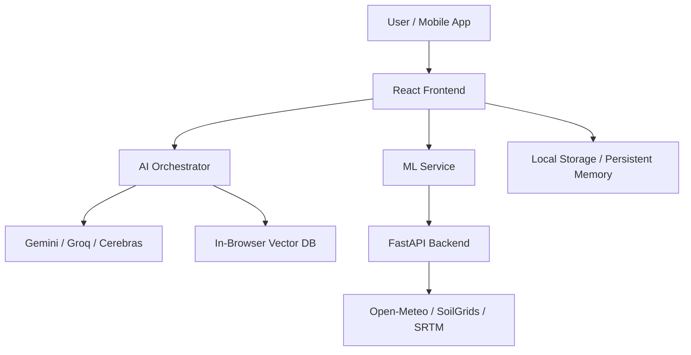

# 🛡️ Bio-SentinelX
## AI-Powered Preventive Health Intelligence Platform


> **Bio-SentinelX is an AI-powered preventive health intelligence platform that predicts health risks BEFORE symptoms appear.**

We fuse real-time environmental data, machine learning, and large language models to forecast disease outbreaks, respiratory hazards, heat stress, and flood risks — empowering individuals and communities to act proactively instead of reactively.

---

## 🚀 Key Features

### 1. Real-Time Environmental Intelligence 🌤️
- **20+ atmospheric variables**: Temperature, humidity, UV index, AQI, PM2.5, PM10, pollen counts, and more.
- **Advanced Data**: CAPE (storm potential), wet-bulb temperature, soil moisture, and UV exposure guidance.
- **Source**: Integrated with Open-Meteo APIs for live and historical data.

### 2. ML Disease Risk Prediction 🤖
- **Stacked Ensemble Model**: Combines Random Forest, XGBoost, and Deep Learning for high-accuracy predictions.
- **Explainable AI**: Shows top contributing factors and signed contributions (SHAP-like) for every risk assessment.
- **In-Browser Training**: Real-time training on custom CSV datasets with auto-detection of features.

### 3. AI Health Risk Assessment 🧠
- **Multi-Provider Support**: Choose from 6+ AI providers (Gemini, Groq, Cerebras, SiliconFlow, OpenRouter, Pollinations).
- **Comprehensive Reports**: Generates interactive markdown reports covering heat stress, respiratory risks, UV exposure, and lifestyle recommendations.

### 4. BioX Assistant (AI Chatbot) 💬
- **Context-Aware**: Understands your weather data, ML predictions, and health profile.
- **Persistent Memory**: Remembers past conversations and auto-summarizes key insights across sessions.

### 5. Flood Prediction & River Risk Monitor 🌊
- **GLoFAS Integration**: 90-day historical + 60-day forecast river discharge data.
- **Composite Risk Score**: Detects rising trends, seasonal anomalies, and rising water levels.

---

## 🛠️ Tech Stack

- **Frontend**: React 18, TypeScript, Vite, Tailwind CSS, Recharts
- **Mobile**: Capacitor (Cross-platform Android app)
- **AI Layer**: 
    - **Providers**: Gemini, Groq, Cerebras, SiliconFlow, OpenRouter, Pollinations
    - **RAG**: In-browser vector database for medical research retrieval
- **ML Backend**: FastAPI (Python), XGBoost, Scikit-learn, TensorFlow Lite
- **Data Sources**: Open-Meteo (Weather, Flood, AQI, Pollen), OpenTopoData, OpenStreetMap

---

## 🏗️ Architecture



---

## 🏅 Unique Selling Points

- **Preventive, Not Reactive**: Predicts risks before you feel them.
- **Zero-API-Key Fallback**: Works out of the box with Pollinations and TF-IDF.
- **Persistent Memory**: No login required; all data stays in your browser (LocalStorage).
- **Explainable ML**: We don't just give a score; we tell you *why*.
- **Mobile Ready**: Optimized for both web and Android.

---

## 📦 Installation & Setup

### Prerequisites
- Node.js (v18+)
- Python 3.10+ (for ML API)
- API Keys (Optional): Gemini, Groq, etc.

### Frontend Setup
```bash
git clone https://github.com/gaur-avvv/Bio-SentinelX.git
cd Bio-SentinelX
npm install
npm run dev
```

### ML API Setup
```bash
cd flood_ml_api
pip install -r requirements.txt
python main.py
```

---

## 📜 License
This project is licensed under the MIT License.

---

**Made with ❤️ for preventive healthcare**
*Bio-SentinelX — Your Health, Predicted.*
